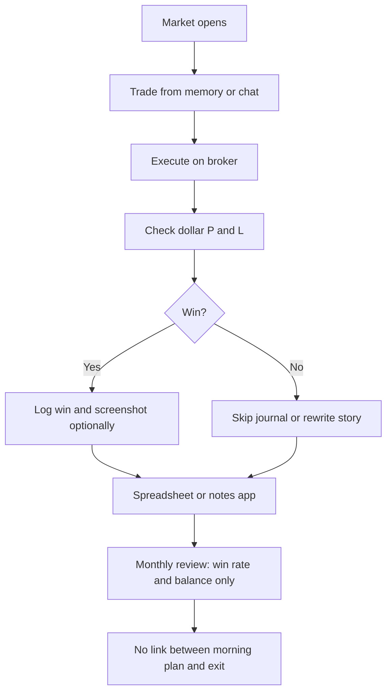
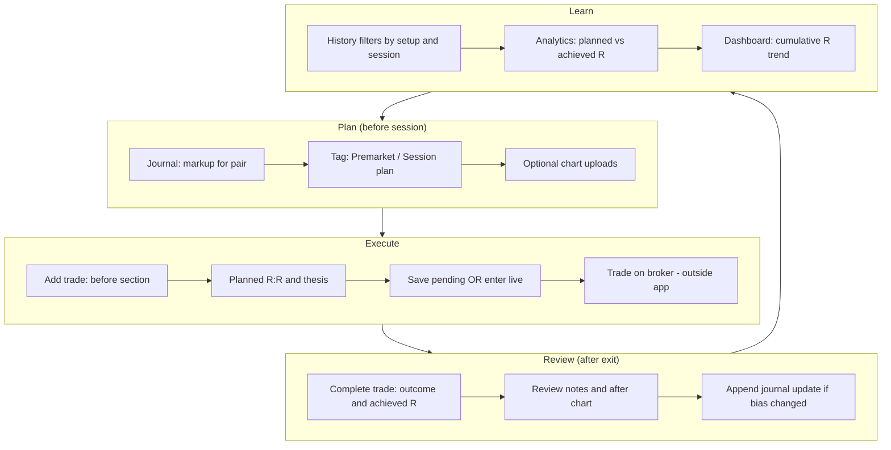
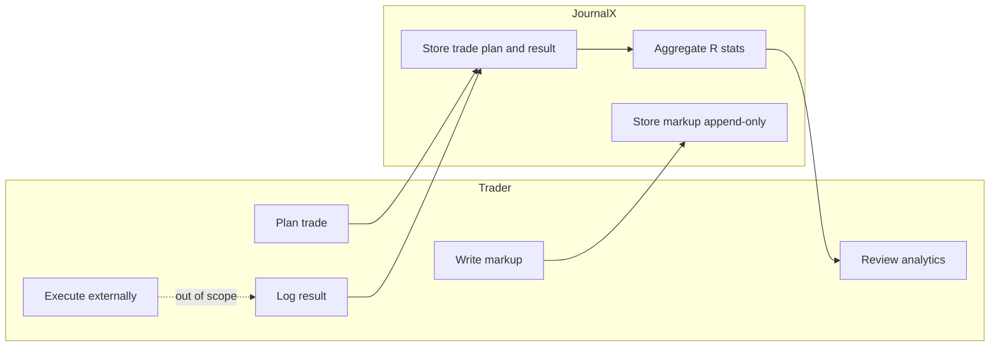

# Process — as-is vs to-be (trader journaling)

## Purpose of this document

Contrast typical **ad-hoc trader journaling (as-is)** with the **JournalX target process (to-be)** to show why requirements emphasize R, planning, and append-only records.

---

## As-is: trader journaling today

Common pattern when P&amp;L and spreadsheets drive the habit:

**Pain points:**

- Planning lives in head, Discord, or deleted chart markup.
- Journal entries edited after the fact; hindsight bias.
- Success measured in account currency, not risk-normalized R.
- Session/setup edge is invisible in aggregates.

---

## To-be: JournalX process

Process the product is designed to enforce:

**Improvements:**

| As-is gap | To-be behavior |
|-----------|----------------|
| Dollar fixation | R-multiples and planned R:R only (BR-01) |
| Plan discarded | Pending trade + plan notes + before chart (FR-020, FR-021) |
| Rewritten history | Append-only markup updates (FR-012, BR-03) |
| Weak retrospectives | History + analytics by pair, session, setup (FR-030, FR-043) |

---

## Swimlane (optional view)

---

## Related documents

- [01-context.md](./01-context.md)
- [07-sequence-flows.md](./07-sequence-flows.md)
- [03-requirements.md](./03-requirements.md)
