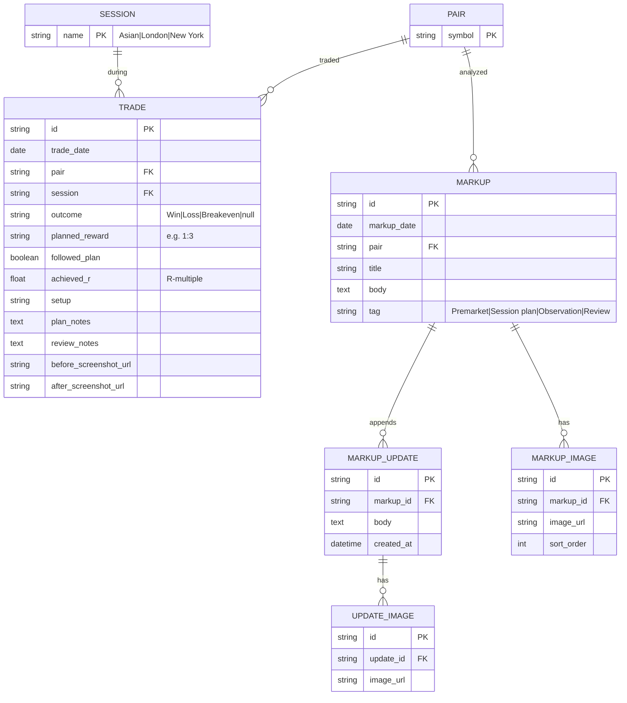

# Data model — JournalX

## Purpose of this document

Define core entities, attributes, and relationships for trades and journal markups. Aligns with prototype types in `src/lib/trades.ts` and `src/lib/journal.ts`.

---

## Entity summary

| Entity | Description |
|--------|-------------|
| **Trade** | One planned and optionally completed trade in R terms |
| **Markup** | Pair-specific journal entry for a calendar day |
| **MarkupUpdate** | Append-only child record on a markup |
| **Pair** | Instrument symbol from a fixed catalog (e.g. EUR/USD) |
| **Session** | Trading session enum: Asian, London, New York |
| **Setup** | Free-text strategy tag on a trade (not normalized in v0) |

---

## ERD (logical)

**Note:** In the v0 frontend, `Markup.images` and update images are string arrays rather than normalized `MARKUP_IMAGE` rows; the ERD shows the target persistence shape.

---

## Trade — data dictionary

| Attribute | Type | Required | Rules |
|-----------|------|----------|-------|
| id | string | Yes | Unique, e.g. `T-001` |
| date | ISO date | Yes | Trade day (time may extend to datetime in UI) |
| pair | string | Yes | Must be in pair catalog |
| session | Session | Yes | Asian \| London \| New York |
| outcome | enum | No until complete | Win, Loss, Breakeven |
| plannedReward | string | Yes | Risk-to-reward label, e.g. `1:3` — not currency |
| followedPlan | boolean | No | Used for plan adherence analytics |
| r | number | When complete | Achieved R; losses typically −1 |
| setup | string | No | e.g. Liquidity sweep |
| planNotes | text | No | Thesis before entry |
| reviewNotes | text | No | Post-trade reflection |
| beforeScreenshot | url | No | Chart at plan/entry |
| afterScreenshot | url | No | Chart after exit |

**Excluded by policy:** balance, profit_currency, lot_size, commission (BR-01).

---

## Markup — data dictionary

| Attribute | Type | Required | Rules |
|-----------|------|----------|-------|
| id | string | Yes | Unique, e.g. `M-024` |
| date | ISO date | Yes | Usually “today” on create |
| pair | string | Yes | From pair catalog |
| title | string | Yes | Short idea label |
| body | text | Yes | Bias, levels, invalidation |
| tag | enum | Yes | Premarket, Session plan, Observation, Review |
| images | string[] | No | Multiple chart uploads |
| updates | MarkupUpdate[] | No | Append-only |

### MarkupUpdate

| Attribute | Type | Required | Rules |
|-----------|------|----------|-------|
| id | string | Yes | Unique |
| body | text | Conditional | Text and/or images |
| images | string[] | No | |
| createdAt | ISO datetime | Yes | Audit ordering |

---

## Pair catalog (reference)

Prototype list includes: EUR/USD, GBP/USD, USD/JPY, GBP/JPY, AUD/USD, USD/CAD, NZD/USD, EUR/JPY, XAU/USD, BTC/USD, ETH/USD, US30, NAS100 (see `PAIRS` in code).

---

## Related documents

- [07-sequence-flows.md](./07-sequence-flows.md)
- [03-requirements.md](./03-requirements.md)
