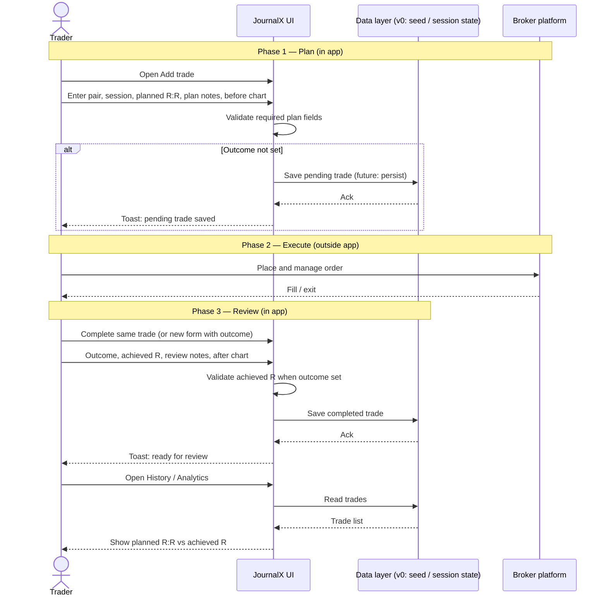
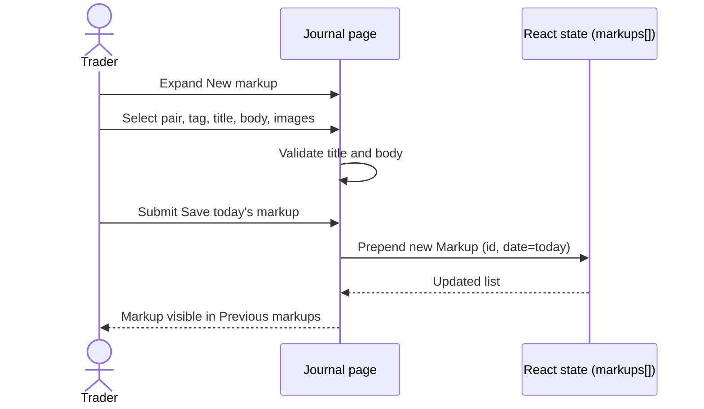
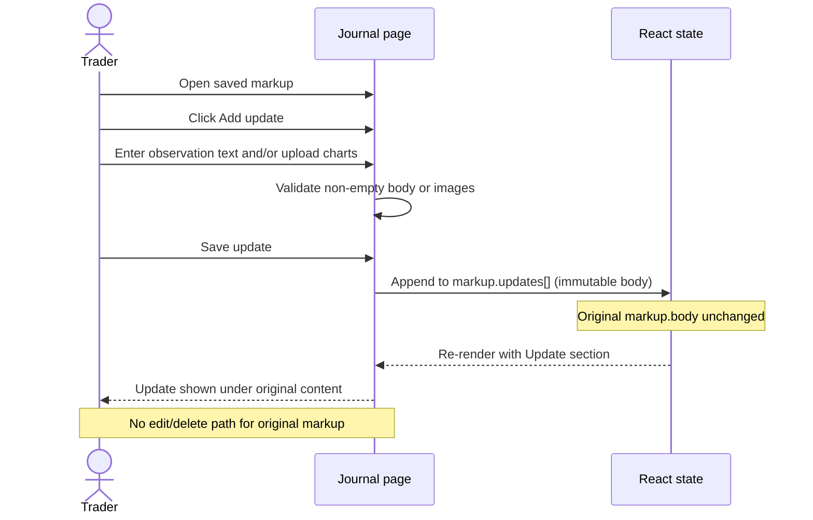
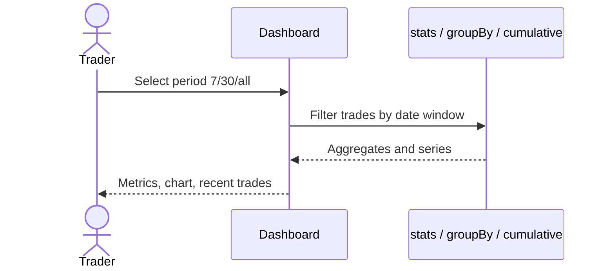

# Sequence flows — JournalX

## Purpose of this document

Describe interaction order for the core lifecycle **plan trade → execute (external) → review**, plus **append-only markup** updates.

---

## SF-01 — Plan trade → execute → review

**Requirement mapping:** FR-020–FR-023, FR-030, FR-041

**Prototype note:** Add trade currently validates and toasts; trade list for history/analytics reads from static `trades` seed until backend persistence (NFR-004).

---

## SF-02 — Morning markup (today-first)

**Requirement mapping:** FR-010, FR-013

---

## SF-03 — Append-only markup update

**Requirement mapping:** FR-012, NFR-003, BR-03

---

## SF-04 — Dashboard read path

**Requirement mapping:** FR-001, FR-002

---

## Related documents

- [05-process-as-is-to-be.md](./05-process-as-is-to-be.md)
- [06-data-model.md](./06-data-model.md)
- [04-use-cases-stories.md](./04-use-cases-stories.md)
